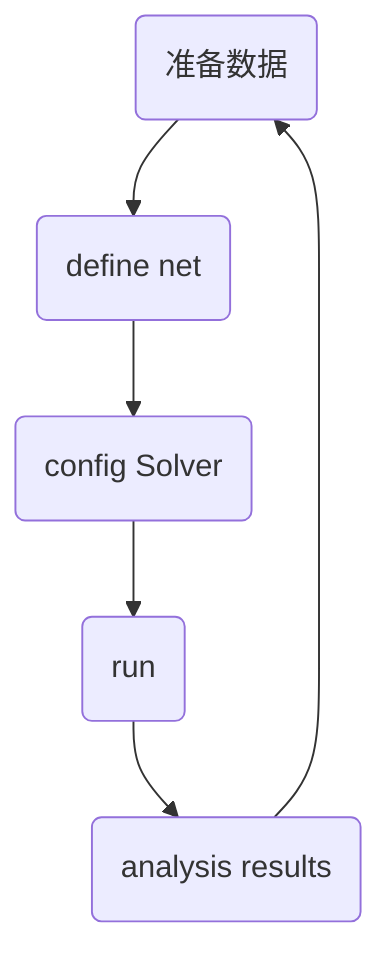

# 可视化


## 一、怎么画出自己的网络结构？

*   工具路径：`caffe/python/caffe/draw_net.py`

    ```shell
    python caffe/python/caffe/draw_net.py xxx.prototxt yy.png --rankdir=BT
    # 可以看出，参数有三个：1.网络文件 2.输出的图片文件 
    # 3.--rankdir= 的参数有四个可选：BT\TB\LR\RL；BT：从底向上的方向绘制，其他同理。
    ```

    

测试跑模型大概需要多少时间

```shell
# 测试 xxx.prototxt 网络迭代100次的时间
caffe time -model xxx.prototxt -iterations 100
# 默认是CPU,如果指定GPU，加上 -gpu 0
```


如何把训练的时候输出的信息保存？

```shell
caffe train -solver xxx.prototxt 2>1 | tee a.log # 意思：把错误输出重定向到标准输出，再用tee命令输出的文件中。效果是：屏幕是没有输出的，因为都重定向到 a.log 了
caffe train -solver xxx.prototxt 2>&1 | tee a.log # 意思：把重定向过程变为后台的过程，这样屏幕就有输出了。

# 说明：
# 2 是错误输出
# 1 是标准输出
```

## 二、怎么可视化训练过程产生的信息？

*   工具路径：`caffe/tools/extra/parse_log.py`  ---> 该文件提取`log`的信息
*   `caffe/tools/extra/plot_training_log.py.example` ---> 该文件就是提取之后可视化！

```shell
# 查看提示信息：
python caffe/tools/extra/plot_training_log.py.example
# 按照提示：输入 使用哪一种图表，和 log 文件路径 就可以了
# 运行后，会生成 x.log.test x.log.train 两个文件。记录提取的训练和测试的一些信息。
```


# py 接口

```python
caffe.set_mode_cpu() 
src = caffe.io.load_image("path")

# 网络的加载
net = caffe.Net(model_def,      # 定义模型结构 
                model_weights,  # 包含模型训练权重
                caffe.TEST)     # 使用测试模式(训练中不能执行dropout)

net.blobs["data"]
net.blobs["data"].data[...] = src[np.newaxis,:,:,:].transpose(0,3,1,2)# blobs的顺序是(1,3,360,480)，代表一张图片，3通道，行（高），列（宽）；而src读进来后的格式(360,480,3)，所以需要transpose，同时新建一维
```

```python
# 以下不属于caffe，但是又用到的
# 计算均值，该方法需要先用caffe自带的算均值的例子得到xxx.binaryproto 再转化xxx.npy文件
meanValue = np.load("mean_train.npy") # 加载均值文件；mean_train.npy 是numpy格式
meanValue = meanValue.mean(1).mean(1) # 对所有像素值取平均以此获取BGR的均值像素值
print('mean-subtracted values:', zip('BGR', mu))
# 取平均后得到BGR均值分别是[104.00698793,116.66876762,122.67891434]
```

```python
# 一个可以分类的程序1
import caffe,os
import numpy as np
import matplotlib.pyplot as plt

print(os.getcwd())
src = caffe.io.load_image("data/cat.jpg")
net = caffe.Net("./data/deploy.prototxt",
                "./data/solver_iter_2000.caffemodel",
               caffe.TEST)

mu = np.load("data/mean.npy")
mu = mu.mean(1).mean(1)
print("mean_values:", list(zip("BGR", mu)))

transformer = caffe.io.Transformer({"data":net.blobs["data"].data.shape})
transformer.set_transpose("data", (2,0,1))
transformer.set_mean("data", mu)
transformer.set_raw_scale("data", 255)
transformer.set_channel_swap("data", (2,1,0))

net.blobs["data"].reshape(50,3,256,256)
src = caffe.io.load_image("data/711.jpg")
transformed_image = transformer.preprocess("data", src)
plt.imshow(src)
net.blobs["data"].data[...] = transformed_image

output = net.forward()
output_prob = output["prob"][0]
labels={0:"bus",1:"1 dianosour",2:"ele",
       3:"flowers",4:"horse"}

print("pre class is:", output_prob.argmax())
print("label is:", labels[output_prob.argmax()])

# =============================================================================

# 一个可以分类的程序2
import numpy as np
import sys,os
import caffe

NETPATH   = "deploy.prototxt"
MODELPATH = "solver_iter_2000.caffemodel"
MEANPATH  = "mean.npy"

net = caffe.Net(NETPATH, MODELPATH, caffe.TEST)
transformer = caffe.io.Transformer({"data":net.blobs["data"].data.shape})
transformer.set_transpose("data", (2,0,1))
transformer.set_mean("data", np.load(MEANPATH).mean(1).mean(1))
transformer.set_raw_scale("data", 255)
transformer.set_channel_swap("data", (2,1,0))

img = caffe.io.load_image("312.jpg")
transformed_image = transformer.preprocess("data", img)
net.blobs["data"].data[...] = transformed_image

output = net.forward()
output_prob = output["prob"][0]
labels = np.loadtxt("label_word.txt", str, delimiter=' ')

plt.imshow(img)
plt.axis("off")

print("pre class is:", output_prob.argmax())
print("label is:", labels[output_prob.argmax()][1])
plt.title(labels[output_prob.argmax()][1])
plt.show()
```


## 参考

1. [Caffe学习笔记（1）--Python接口](https://blog.csdn.net/Jesse_Mx/article/details/58605385)
2. [网络文件可视化](http://ethereon.github.io/netscope/#/editor)
