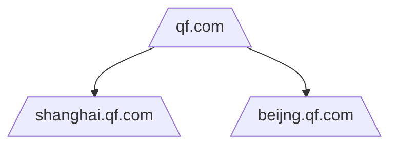
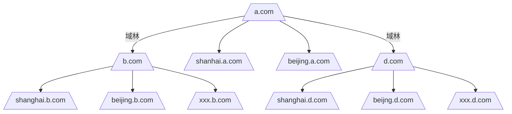

# 部署域控制器

---

[toc]

---

## 一、环境与说明

* Server 2008x64，xp,win7
* 说明：
    1. 装域控制器就是安装活动目录（AD）。
    2. 2008安装服务器的软件时不用再像2003需要插入光盘了，因为装2008的时候已经内置到里面了，只是没有启用。那么在哪里可以找到这些软件并且安装呢？右键【计算机】---【管理】---【角色】--- 最右边【添加角色】
    3. 这次实验，是把DC也同时配置为DNS服务器。

## 二、步骤

### step1：安装前的准备

1. 服务器关闭防火墙。
2. 服务器要和成员机在同一网段（局域网）
3. 设置静态IP（**建议取消IPV6的勾**），不用设置DNS。（配置好后禁用启用以下网卡）

### step2：安装 DC

* 本来我们可以安照【一、环境与说明】的方法安装，但是我们有更好的方法。

步骤：开始 --- 运行 --- 输入 dcpromo 安装活动目录 --- 下一步（不用勾选高级模式）--- 到【配置域名系统客户端设置】勾选【通过在此计算机上安装DNS服务器 ...】--- 勾选【在新林中新建域】--- 【目录林根级域的FQDN】以公司名称如`qf.com` --- 【林功能级别】和【域功能级别】都选择2003 --- 默认下一步到弹框【无法创建该dns的委派...】选【是】--- 默认 --- 设置密码 --- 下一步完成。

**说明：**

1. 【操作系统兼容性】：在安装的第一步，会有【操作系统兼容性】提示。这一大段话说的是：用2008做的域控制器可能有的东西不太适合老系统。比如把xp加到域，会有点差异性。（不用管）
2. 【配置域名系统客户端设置】：因为一开始设置静态IP没有设置DNS，它提示这个服务器没有指向DNS，提供两个方案给你，a.继续的话就添加DNS先。b.把这台服务器设置为DNS。
3. 域树：假设我有两公司，总部在北京，分部在上海。北京的配好了DC，现在我想让上海的员工也加入到我这个域，怎么做？
    * 法一：大公司，都会有专线，就是直接拉条网线北京到上海。这样相当于一个局域网了。上海的员工可以直接加入这个域。
    * 法二：为了方便管理，我想上海的也有一台DC，那思路就是上海的DC认北京的DC作老大。那么，北京的域称为**主域**(qf.com)，上海的称为**子域**（shanghai.qf.com）。这样一来，如果有多个子域，子域又有子域，就像一棵树了。这颗树由域组成的，就成为域树（顶上是树根，底下是树叉/支）。
4. 林：有了域树的概念。在这里我们就摒弃总部的概念了哈，在这里假设，我30岁创建公司，搞研发的，于是有了第一个域。后来我又创建了第n家公司，做教育的，做宣传的，做贸易的等等。n个公司，n个域（除了第一家），这时候我们不认第一个公司老大。（详细的可以看看小结或者网上查一查）。
5. 现有林 --> 向现有域中添加域控制器：意思是林里有域了，在这个域添加一个备份域控制器。
   --> 在现有林中新建域：意思是林里有其他域了，在建一个域。
   在新林中新建域：意思是新建林，新建域。什么都没有，也就是装的第一个域控制器。
6. 林功能级别：如果选择2003，那么以后加入该林的域控制器，至少在2003（含）以上（该林的所有域控制器，包括该林的子域），否则成为不了第二台域控制器。
7. 域功能级别：如果选择2008，那么以后该域下的DC至少2008（含）以上。
   和上面的 林功能级别 怎么理解和配合呢？
   我的理解如下图：
   
8. 数据库文件夹：域能集中管理全靠AD，AD就是一个表，一个数据库嘛就。这个就是活动目录的位置。
9.  SYSVOL 文件夹：组策略放的位置。（成员机就是从这里拿的策略去设置自己的相关配置）。
10. 目录还原模式的Administrator密码：这个密码不是域管理员的密码，是活动目录的密码。是用于将来还原活动目录的时候的密码，一般用不到，但是也要复杂一点。

### step3：验证部署结果（看看是不是真正成为DC了）

* 右键属性【我的电脑】，查看计算机是否在域
* 【菜单】---【管理工具】---看看有没有【Active Directory 用户和计算机】的服务（这个是AD的数据库）
  看看 computer: 普通域成员机列表
  Domain Controller: DC 列表
  users: 域账号
* 【菜单】---【管理工具】---【DNS】---【正向查找区域】---看看有没有设置的域名的区域配置文件（最重要的两条记录：类型都是：主机。看看 IP 是不是 IPV4的（其中，有名称的是负责解析 DC 的名字，另外一条是解析域名的））

* 其他
  * 这个 DC 已经没有了 本地用户和组 了（前后可通过运行 `lusrmgr.msc` 对比下），那之前的本地账号去哪了？
    被迁移到了 活动目录那张表里去了，就是说以前的管理员只能管理本地。但是现在升级成了域管理员了（本地组也升级 域组）。（DC只能登录域，没有本地账户了。其他成员机还可以登录本地账户）

**小结：**

* 林一般以第一个创建的域命名。

* 林功能级别限制的是一个全局的（因为你选了一个高的，下一步域功能级别，你只能看到这个高的版本以上的版本）。域功能级别限制的是局部的。

* 树和林的唯一区别就是，命名不同。（可以看看百度百科的解释：域林是指由一个或多个没有形成连续名字空间的域树组成，它与域树最明显的区别就在于**域林之间没有形成连续的名字空间，而域树则是由一些具有连续名字空间的域组成**。）

比如：域树，它们是具有相同的后缀



域林：是没有同后缀的。



## 三、加入域

* 先确保在同一网段
* 在DC的【Active Directory 用户和计算机】，右键 【Users】新建用户 --- 【用户登录名】才是用作登陆的账号。
* 注意成员机还要配置 DNS，因为成员机加入的时候，通过 DNS 找到 DC，然后加入。

XP：成员机打开电脑属性 --- 【计算机名】--- 下面有一个关于域的【更改】--- 【隶属于】输入 hzh.com

WIN：成员机打开电脑属性 --- 【计算机名】--- 更改设置---【隶属于】输入 hzh.com

* 注意：如果域是 `qf.com`，登录的时候只要写 `qf/xxx` 登录就可以了
  如果是 `gcn.qf.com` 写 `gcn/xxx`

## 四、总结

1. 当部署了DC之后，这台电脑就没有本地用户和组了。那以前这台电脑的本地管理员跑哪去了？被迁移到活动目录那张表上了。就是以前的本地管理员变成了域管理员。（所以，如果攻击一个域的话，只要攻击DC就好了，把域管理员账号拿到了，整个域就拿到了）

2. 登陆域，账户填写 `QF\Administrator`，如果填写 Administrator，就是登陆本地了。
    * 进入桌面之后，右键电脑属性可以看到，不是显示工作组，是域。
    * 打开DNS，可以看到正向查找区域已经有本机的解析记录了（如果没有，说明DC配置失败）

3. 打开【Active Directory 用户和计算机】
    * 【Computers】：成员机列表
    * 【Domain Controllers】：该域中都有哪些DC。
    * 【Users】：域账号、域组、域来宾

4. 本地管理员组：Administrators

    域管理员组：Domain Admins

    成员机加入到域之后，会添加域管理员组到本地的管理员组中。因此，域管理员才有对所有成员机有完全控制权限。

5. 命令

    ```cmd
    net user /domain  # 查看域所有用户，在成员机上执行的话该请求也会送到DC上，然后显示 DC 的结果
    net time /domain  # 显示 DC 的时间，同样会显示 DC 的 计算机名，然后就可以找到它的 IP 了
    net user /domain hhh 123.com /add # 添加 域用户，需要域管理员才行，因为这个命令送到 DC 上执行的，所以和直接在 DC 上新建用户 没区别
    ```

6. 在 活动目录 里的 【Domain Controllers】新建的用户是管理员嘛？
   --> 不是，只有把用户添加到【Domain Admins】才是管理员。
   --> 方法：打开活动目录 -->点【Users】-->右边双击【Domain Admins】--> 【成员】添加

    但其实这就是 OU 和 组 的区别了，活动目录的那些文件夹 只是 OU，一个容器，方便管理而已。
    组才是设置权限的地方。

## 五、问题

### 5.1 加入域不成功

* 输入域地址后，不弹框要你输入域账号

    问题分析：
    （1）没有联系到DC；联系DC需要什么？首先需要解析到DC的IP，需要要DNS

  * a:有没有在同一局域网；
  * b. 解析不成功，有没有指定DNS；
  * c. ping dns的地址，是通的，那还是解析问题，看看DNS服务器上有没有DC的解析（注意是没有主机名那条A记录！没有DC的解析而DC又是DNS服务器的话，新建一条主机解析就好了，注意名称不用填，直接填IP地址就行了）（验证步骤说的重要记录）
  * d：如果检查完以上步骤，还是不行，可能成员机用是本机的DNS缓存指向错的地址，清空成员机的DNS缓存。

### 5.2 登入域不成功

要在登陆界面看看是登陆本机还是域。
方式：`username@domain` 或者 `domain\username`

### 5.3 域用户的权限

虽然用刚创建的域账号可以登陆别人电脑，但是对于这台电脑本身来说，域账号还是普通的账号，对这台电脑并没有完全的控制权限。（**域管理员就有对所有电脑的完全控制权限**）那普通员工怎么用域账号对自己的电脑拥有完全的控制权限呢？不能把他的权限提升为域管理员吧，这样他登陆这个域的所有成员机都有完全的控制权限了。所以需求是：对自己的电脑有完全控制权限，但又不提升为域管理员。**解决方法是：把员工的域账号添加到本地的管理员组中**。这样该员工的域账号就只能对自己的电脑有完全的控制权限，同时因为不在别人电脑的本地管理员组中，所以对别人电脑就没有完全控制权限。

## 参考

1. [林、域树、子域](https://www.cnblogs.com/zpchcbd/p/11706852.html)
