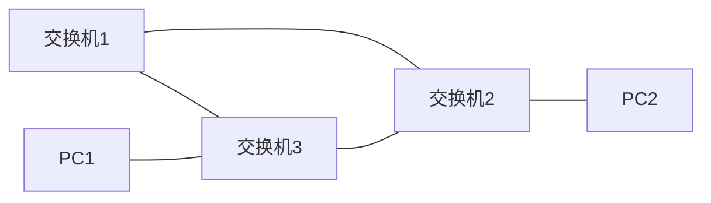

# STP

[TOC]

## 一、背景

如上图，三个交换机形成环路。

* 优点： PC1 有两条路可以和 PC2 通信。其中一条路坏了也不怕。
* 缺点：PC1 发广播，导致 交换机3 说要广播，交换机1和2 也转发广播，形成广播风暴。原因是二层交换机控制不了广播（你说不是有 TTL 吗？TTL是三层的。你又说用 VLAN ，可是交换机之间的配 TRUK 的，所以也不行。）

如何解决缺点？如下：

## 二、 STP

* STP --- 生成树

三个交换机之间通过协商，决定了一个老大出来（可以理解为树的根），比如说 交换机1 当老大了。然后就把 交换机2和3 之间的线路 逻辑 down 掉（表面上看是 up 的），这样有一条断开了就不会形成广播风暴。当原本线路坏了，马上用另一条。（这样就实现了备份线路又不产生广播风暴）

## 三、PVST、MST

1. PVST 全称 PVSTP，每个生成树。（思科的协议）
2. MST 多生成树（公有协议）

STP 协议把其中一条线路 down 掉。不就浪费了吗？所有的流量都往一条路走。
现在，基于 VLAN 来，就是考虑这个局域网多大啊。

* 首先，三个交换机说，我们先从 VLAN 10 来选举，在 VLAN 10 里选个老大。
* 然后，换个 VLAN 再选老大。

这样，每个 VLAN 的流量都会有不同的线路可以走。当其中一条线路坏了可以切换到另一条。实现了流量均衡。
